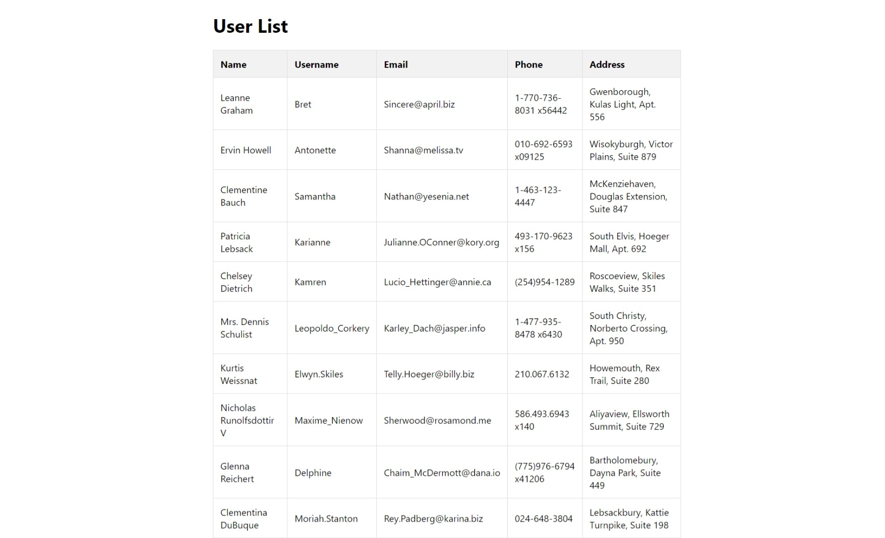

# Intro

A simple React application to fetch and display a list of users from a mock API. The project demonstrates how to map through arrays in React, the importance of keys in lists, and responsive table styling.

## Features

- Fetches user data from a mock API using Axios.
- Renders the user list dynamically using the `map` function.
- Displays user information in a responsive table format.
- Utilizes unique keys for efficient rendering.

## Installation

1. Clone the repository:

   ```bash
   git clone https://github.com/vsbuidev/reactUserList.git
   ```

2. Change into the project directory:

   ```bash
   cd reactUserList
   ```

3. Install dependencies:

   ```bash
   npm install
   ```

4. Run the application:

   ```bash
   npm start
   ```

   Open [http://localhost:3000](http://localhost:3000) in your browser to view the app.

## Dependencies

- React
- Axios

## Screenshots



## Contributing

If you have an idea, Contributions are welcome! Feel free to open an issue or submit a pull request.

## License

This project is licensed under the MIT License - see the [LICENSE](LICENSE) file for details.

## Usage

- View and interact with the user list.
- Simply this project is developed for educational purposes only !.

Happy Coding!
